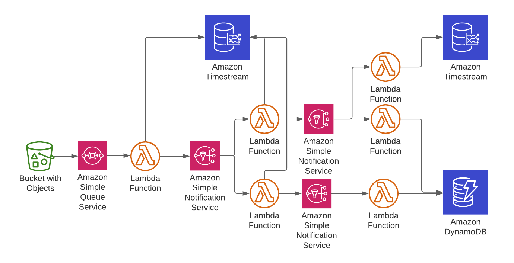

# wowmate mono repo

## manual steps:

- creating the public hosted zone in route53
- enable http api logs
- enable cloudfront advanced metrics

#### local development

start api locally: 
`./build.sh skipFrontend && sam local start-api --template cdk.out/wm.template.json --profile default --env-vars=env.json`

Important to note is, that the API doesn't support hot reloading because cdk zips the go code up and moves it to cdk.out dir.
That is the path in the cfn that sam cli uses, if I rebuild my go binaries, it doesn't matter, because the path changed.

invoke a single lambda: 
`./build.sh skipFrontend && echo '{"pathParameters": {"dungeon_id": "2291"}}' | sam local invoke ApiDamageDungeonSummariesLambda00443886 --no-event --template cdk.out/wm.template.json --event - --profile default --env-vars=env.json`

invoke a lambda on every safe:
`watcher -cmd="./invokeLogDmg.sh" -pipe=true $(find $directory -type f -name "*.go" -not -path "./cdk.out/*" | tr '\n' ' ')`

To generate an event run `sam local generate-event sqs receive-message`. When passing in another 
event as a body, make sure it is an escaped string, see convertInput.json as an example. 
To get the message body print the string of body to the log

#### go mod

e.g. `go mod init github.com/jonny-rimek/wowmate/services/api/combatlogs-combatlog-uuid-damage`

#### go mod replace

`go mod edit -replace y=github.com/wowmate/jonny-rimek/wowmate/services/upload/convert/normalize./normalize`

add code that uses the package e.g. `normalize.Normalize`

manually import the package in the import section by adding `"github.com/wowmate/jonny-rimek/wowmate/services/upload/convert/normalize"`

#### upload infrastructure

